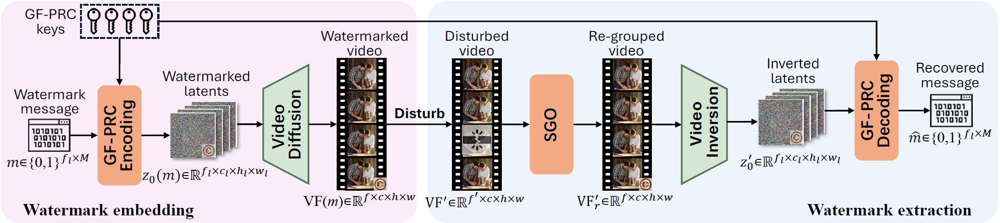
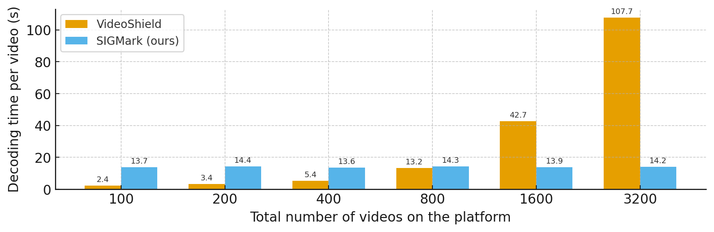

# SIGMark-internal test version

This is the implementation for SIGMark: an in-generation video watermarking framework.

> **SIGMark: Scalable In-Generation Watermark with Blind Extraction for Video Diffusion**
> 
> By Xinjie Zhu, Zijing Zhao, Hui Jin, Qingxiao Guo, Yilong Ma, Yunhao Wang, Xiaobing Guo and Weifeng Zhang
> 
> Accpted by ICLR 2026



### 1. Environment preparation

Clone this repository, and create a conda environment.

#### 1.1 Basic requirements

Our project is built upon the following basic environment:

- CUDA 11.8

- Python 3.10

- torch 2.5.0

Any version of pytorch that match the python and CUDA version can work on this project.

Other requirements can be installed through:

```
pip install -r requirements.txt
```

#### 1.2 Video generation fundation models:

In this project we now support `HunyuanVideo` and `HunyuanVideo-I2V`. You can download the community version of model files from huggingface:

[HunyuanVideo](https://huggingface.co/hunyuanvideo-community/HunyuanVideo/tree/main), [HunyuanVideo-I2V](https://huggingface.co/hunyuanvideo-community/HunyuanVideo-I2V)

And then place the files under the model in `<MODEL_PATH>` which you can configure:

```
[MODEL_PATH]
    └─ HunyuanVideo-community
        └─ model_index.json
        └─ transformer
        └─ text_encoder
        ...
    └─ HunyuanVideo-I2V-community
        └─ model_index.json
        └─ image_processer
        └─ transformer
        └─ text_encoder
        ...
```

### 2. Video generation datasets

We use [VBench-2.0 prompt suites](https://github.com/Vchitect/VBench/tree/master/VBench-2.0/prompts) for video generation evaluation.

In `./prompt_set` we introduce all the prompt suites proposed by VBench-2.0, including `VBench2_prompt` for general models, `VBench2_ch_prompt` for models with Chinese prompts, `VBench2_aug_prompt` for `HunyuanVideo`, `CogVideoX` and `Kling` models, and `wanx_aug_prompt` for `Wan` models. You can configure the dataset by `--prompt_set` in `main.py`.

In this project we test `HunyuanVideo` with `VBench2_aug_prompt`. 

We also test `HunyuanVideo-I2V` with `VBench2_aug_prompt` text prompts and `VBench2_aug_img_prompt` image prompts which are generated images with `VBench2_aug_prompt` text prompts by [FLUX.1](https://huggingface.co/black-forest-labs/FLUX.1-dev). The link of the generated image prompts are from:

[Image prompt link coming soon](https://gitlab.xpaas.lenovo.com/watermark/watermark-video). 

Please download the generated image prompts, unzip the file and place the directory under:

```
./prompt_set
    └─ VBench2_aug_img_prompt  # place the downloaded files here
    └─ VBench2_aug_prompt
    └─ VBench2_ch_prompt
    └─ VBench2_prompt
    └─ wanx_aug_prompt
    └─ meta_info
    └─ __init__.py
    └─ vbench2_prompt_set.py
```

We test the results on subset of the text prompts of totally 88 prompts generating 400 video samples.

### 3. Watermark generation and extraction

#### 3.1 Basic Usage

The file `main.py` launches the watermark generation or extraction according to configuration. For example, if you wish to generate watermarked videos (128x4 bit watermark on 512x512, 65 frames video) with `SIGMark` watermarking on `HunyuanVideo-I2V` model, run the following scripts:

```python
python main.py \
--mode=gen \  # Mode, 'gen' for generation, 'extract' for extraction
--model_base_path=/dfs/share-read-write/zhuxj11 \  # model path
--model_name=HunyuanVideo-I2V-community \  # model name
--prompt_set=VBench2_aug \  # prompt suite name
--image_prompt_dir=./prompt_set/VBench2_aug_img_prompt \  # image prompts
--watermark_method=sigmark \  # watermark method name
--quant_text_encoder=0 \  # whether to do quantization on text encoders
--ch_factor=2 \  # on channel dimension every 'ch_factor' elements encode 1 bit watermark message
--hw_factor=16 \  # on h&w dimensions every 'hw_factor' elements encode 1 bit watermark message
--fr_factor=4 \  # on frame dimension every 'fr_factor' elements encode 1 bit watermark message
--batch_size=1 \  # generation batch size
--output_path=./outputs/HunyuanI2V-128x4/sigmark  # output path
```

We also support multi-GPU inference, for example, launch the job using 4 GPUs: 

```python
CUDA_VISIBLE_DEVICES=0,1,2,3 torchrun --nproc_per_node=4 main.py --<arg>=<arg content>
```

After generating videos to `<output_path>`, you can simple change the `--mode=extract` to launch watermark extraction and test the extracted bit accuracy.

#### 3.2 Scripts on different settings

Our projct provide our method `SIGMark`, and support 2 baseline methods: [VideoShield](https://github.com/hurunyi/VideoShield) and [VideoMark](https://github.com/KYRIE-LI11/VideoMark). We also support generating videos without watermark for comparison on video quality. All the scripts are under `configs` folder:

```
./configs
    └─ HunyuanI2V-512x16  # HunyuanVideo-I2V model, 128x4 bit watermark
        └─ sigmark.sh  # SIGMark watermarking
        └─ videoshield.sh  # VideoShield watermarking
        └─ videomark.sh  # VideoMark watermarking
    └─ HunyuanT2V-512x16  # HunyuanVideo model, 128x4 bit watermark
        └─ sigmark.sh  # SIGMark watermarking
        └─ videoshield.sh  # VideoShield watermarking
        └─ videomark.sh  # VideoMark watermarking
    └─ HunyuanI2V.sh  # HunyuanVideo-I2V model without watermark
    └─ HunyuanI2V.sh  # HunyuanVideo model without watermark
    └─ extraction_cost.sh  # Run watermark extraction cost testing
```

This scripts launch both watermark generation and extraction with 4 GPUs. GPU number under 4 are supported. Batch size 1 per GPU (batch size 4 for 4 GPUs for example) is recommanded. Note that 48GB CPU Memory is required.

**Note: change the configuration of the first 8 lines in the scirpts, including your conda path (line 1), the project path (line 2), conda enviroment name (line 3) and model path (line 7).**

For example, simply run:

```bash
bash ./configs/HunyuanI2V-128x4/sigmark.sh
```

To launch watermarked video generation and watermark message extraction.

The required CPU memory is >= 48GB. Single GPU memory >= 50GB is required for our scripts (A800 and H20 GPU is required). If you wish to use A100-40GB GPU, set the `--quant_text_encoder=1` to use quantization.

#### 3.3 Small scale testing

We test the code on A800 GPUs, generating one single video sample on a single GPU takes around 4 min, thus the whole dataset of 400 videos takes around 27 GPU hours.

If you wish to first run through the code on small scale data, add the arg `--small_scale_test=4` in the scripts for example to run the first 4 batches.

#### 3.4 Analyzing time and space cost during extraction

Baseline methods like `VideoShield` and `VideoMark` are all non-blind watermarking. They requires saving all the watermarking information (watermark messages, encoding keys, etc) during watermarked video generation, and matching with all the maintained information during watermark extraction. Thus, the watermark extraction cost (both time and space) depend on the total number of videos generated through the platform.

Our proposed `SIGMark` is a blind watermarking which only maintain a global set of frame-wise PRC keys and requires no additional information during extraction, thus can be applied to large-scale video generation platforms with a constant level of time and space cost during extraction.

We provide a script to analyze the watermark extraction time and space cost of both baseline methods and our proposed `SIGMark`, testing the cost of extracting the watermark in a single video under the situation that a total number of multiple videos are generated by the platform:

```bash
python analyze_extraction_cost.py
```

or

```bash
bash configs/extraction_cost.sh
```

For a fair comparison, we run the video inversion phase on GPU, and all other extraction operations including decryption and message matching (required only by baseline methods) on CPU. This script simulates the total number of generated videos of [100, 400, 800, 1600, 3200]. The video scale of 3200 requires **512GB CPU memory and 16 CPU threads** to run.



Results shows that the time and space cost of `VideoShield` grows linearly with the total number of generated videos, which will be unacceptable when the video generation scale raise to millions, while our proposed `SIGMark` remains constant level, demonstrating that our proposed method is scalable.
